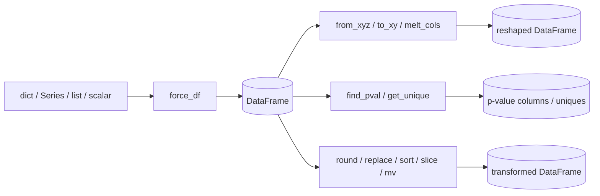
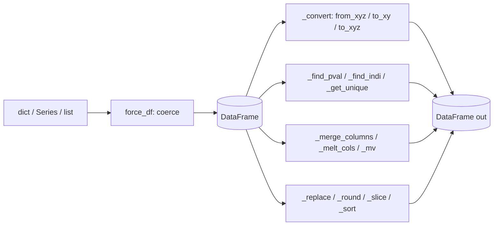

# scitex-pd

<p align="center">
  <a href="https://scitex.ai">
    
  </a>
</p>

<p align="center"><b>Pandas helpers — coerce, reshape, find p-values, merge/melt columns, sort/slice/round.</b></p>

<p align="center">
  <a href="https://scitex-pd.readthedocs.io/">Full Documentation</a> · <code>uv pip install scitex-pd[all]</code>
</p>

<!-- scitex-badges:start -->
<p align="center">
  <a href="https://pypi.org/project/scitex-pd/"></a>
  <a href="https://pypi.org/project/scitex-pd/"></a>
  <a href="https://scitex-pd.readthedocs.io/en/latest/"></a>
</p>
<p align="center">
  <a href="https://github.com/scitex-ai/scitex-pd/actions/workflows/ci.yml"></a>
  <a href="https://github.com/scitex-ai/scitex-pd/actions/workflows/ci.yml"></a>
  <a href="https://github.com/scitex-ai/scitex-pd/actions/workflows/ci.yml"></a>
  <a href="https://codecov.io/gh/ywatanabe1989/scitex-pd"></a>
</p>
<!-- scitex-badges:end -->

---

## Problem and Solution

| # | Problem | Solution |
|---|---------|----------|
| 1 | **Reshape boilerplate** — coercing dicts/Series/lists into DataFrames and locating p-value columns repeats everywhere. | **Coercion helpers** (`force_df`, `from_xyz`/`to_xy`, `find_pval`) with sensible defaults. |
| 2 | **Column ops drift** — every project re-implements rename / reorder / round / merge for stats tables. | **Uniform helpers** (`merge_columns`, `mv`, `round`, `replace`, `sort`, `slice`) — DataFrame in, DataFrame out. |

## Quick Start

```python
import scitex_pd as pd_

pd_.force_df(data)              # Coerce dict / Series / list / scalar → DataFrame
pd_.from_xyz(df, x, y, z)       # Long → wide pivot
pd_.to_xy(df)                   # Wide → long
pd_.find_pval(df)               # Locate p-value columns
```

## Demo



<p align="center"><sub><b>Figure 1.</b> Data flow: coerce anything tabular into a DataFrame, then reshape, inspect, or transform it.</sub></p>

## Installation

```bash
uv pip install "scitex-pd[all]"
```

Requires Python ≥ 3.9.

<details>
<summary><b>Per-extra installs</b></summary>

<br>

| Extra | Pulls in |
|---|---|
| `dev` | tests + lint + dev helpers (`pytest`, `ruff`, `scitex-dev`, …) |
| `docs` | Sphinx docs build (`sphinx`, `myst-parser`, …) |

</details>

## Architecture



<p align="center"><sub><b>Figure 2.</b> Module layout: one helper per file, all DataFrame-in / DataFrame-out around a shared core.</sub></p>

`scitex-pd` is a thin layer on top of `pandas` + `numpy`; the only
non-stdlib dep beyond those is `scitex-types` (for `is_listed_X`).

## 1 Interfaces

<details open>
<summary><strong>Python API</strong></summary>

<br>

```python
import scitex_pd as pd_

# Coerce / convert
pd_.force_df(data)
pd_.from_xyz(df, x, y, z)
pd_.to_xy(df)
pd_.to_xyz(df)
pd_.to_numeric(df)

# Find / inspect
pd_.find_pval(df)
pd_.find_indi(df, mask)
pd_.get_unique(df, "col")

# Reshape / restructure
pd_.merge_columns(df, [...], "out")
pd_.melt_cols(df, [...])
pd_.mv(df, col, position=-1)

# Transform
pd_.replace(df, mapping)
pd_.round(df, ndigits=2)
pd_.slice(df, ...)
pd_.sort(df, ...)

# Warnings
pd_.ignore_setting_with_copy_warning()
```

</details>

## Demo


<p align="center"><sub><b>Figure 3.</b> End-to-end flow: coerce → reshape / inspect / transform → analysis-ready tables.</sub></p>

## Quick Start

```python
import scitex_pd as pd_

pd_.force_df(data)              # Coerce dict / Series / list / scalar → DataFrame
pd_.from_xyz(df, x, y, z)       # Long → wide pivot
pd_.to_xy(df)                   # Wide → long
pd_.find_pval(df)               # Locate p-value columns
```

## Status

Standalone fork of `scitex.pd`. Deps: numpy, pandas, scitex-types (for `is_listed_X`).
The umbrella package's `scitex.pd` import path is preserved via a
`sys.modules`-alias bridge.

## Part of SciTeX

`scitex-pd` is part of [**SciTeX**](https://scitex.ai). Install via
the umbrella with `pip install scitex[pd]` to use as
`scitex.pd` (Python) or `scitex pd ...` (CLI).

>Four Freedoms for Research
>
>0. The freedom to **run** your research anywhere — your machine, your terms.
>1. The freedom to **study** how every step works — from raw data to final manuscript.
>2. The freedom to **redistribute** your workflows, not just your papers.
>3. The freedom to **modify** any module and share improvements with the community.
>
>AGPL-3.0 — because we believe research infrastructure deserves the same freedoms as the software it runs on.

## License

AGPL-3.0-only (see [LICENSE](./LICENSE)).

---

<p align="center">
  <a href="https://scitex.ai" target="_blank"></a>
</p>
